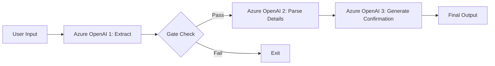

# Building Effective LLM Workflows with Azure OpenAI

This repository contains practical patterns and examples for building effective LLM-powered systems using Azure OpenAI. Based on real-world implementations and lessons learned from working with production systems, these patterns focus on simplicity and composability rather than complex frameworks.

## Azure OpenAI Features

This Azure-optimized version includes:
- **Azure OpenAI Integration**: Native support for Azure OpenAI endpoints and deployments
- **Managed Identity Support**: Secure authentication using Azure Managed Identity
- **Environment Configuration**: Flexible configuration using .env files
- **Retry Logic**: Built-in retry mechanisms for Azure OpenAI service resilience
- **Security Best Practices**: Following Azure security guidelines and best practices

## Setup

1. **Clone this repository**
2. **Install dependencies**: `pip install -r requirements.txt`
3. **Configure Azure OpenAI**:
   - Copy `.env.example` to `.env`
   - Update with your Azure OpenAI endpoint and deployment details
   - Set up either API key or Managed Identity authentication

## Table of Content

In this tutorial, we'll cover everything you need to start building AI agents with Azure OpenAI in pure Python. We'll start with the essential building blocks and then dive into workflow patterns for more reliable systems.

Part 1: Building block: The augmented LLM with Azure OpenAI

- Basic Azure OpenAI calls
- Structured output with Azure OpenAI
- Tool use with Azure OpenAI
- Retrieval with Azure OpenAI
  
Part 2: Workflow patterns to build AI systems

- Prompt chaining
- Routing
- Parallelization
- Orchestrator-Workers

## Workflow Patterns

### Prompt Chaining

Prompt chaining is a powerful pattern that breaks down complex AI tasks into a sequence of smaller, more focused steps. Each step in the chain processes the output from the previous step, allowing for better control, validation, and reliability.

#### Calendar Assistant Example

Our calendar assistant demonstrates a 3-step prompt chain with validation:

### Routing

Routing is a pattern that directs different types of requests to specialized handlers using Azure OpenAI for intelligent classification and routing decisions.

### Parallelization

Parallelization runs multiple Azure OpenAI calls concurrently to validate or analyze different aspects of a request simultaneously, improving performance and reliability.

### Orchestrator-Workers

The orchestrator-workers pattern uses Azure OpenAI to dynamically analyze tasks, coordinate specialized workers, and synthesize their results. This creates a flexible system that can adapt to different types of requests while maintaining specialized processing.

## Azure OpenAI Best Practices

- **Use Managed Identity** when possible for secure authentication
- **Implement retry logic** for transient failures
- **Monitor usage** and implement rate limiting
- **Use structured outputs** for reliable data extraction
- **Follow security guidelines** for production deployments
- **Leverage deployment versioning** for stable production systems
